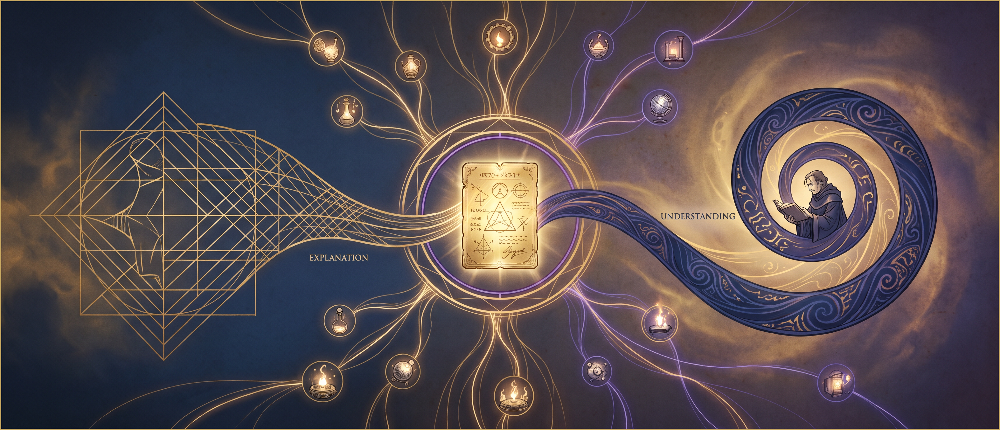

*Two collectives record the same day of work. They agree completely on what happened. They still cannot agree what it was worth.*

---

    

---

## A disagreement with no facts in it

Two collectives share an economic network. A member of the first spends a day repairing equipment belonging to the second. Both record the event. Both use the same vocabulary. Both agree, completely, on what physically occurred: who did what, to which machine, for how long, with what result. Nothing about the facts is in dispute.

They still cannot agree on what it was worth. The first collective treats maintenance as the highest form of contribution, because their whole economy depends on keeping shared machines alive. The second treats it as overhead, because they value the design work that produces new capacity. Neither is wrong. They are reading the same event from inside different economies of meaning.

The obvious engineering response is to add a valuation field and let each party fill it in. That solves nothing. It moves the problem into a column and leaves the real question untouched: whose reading gets to be the record?

This is not an edge case. It is the normal condition of any set of communities that share infrastructure without sharing a worldview, which is to say every commons, every federation, and every bioregional economy that has ever existed. If a protocol cannot hold this, it cannot hold the thing it was built for.

So the question is where, architecturally, meaning is allowed to live.

## Two disciplines, and the man who refused to choose

There are two mature bodies of work on that question, and they have been talking past each other for a century and a half.

Semantic analysis treats meaning as structure. Decompose a term into features, or define it by its position in a system of oppositions, or represent it as a point in a space learned from a corpus. Structural semantics, formal semantics and modern embedding models are very different projects, but they share one commitment: meaning can be made explicit, and ideally computable. The interpreter is neutralised on purpose. If two analysts using the same method get different answers, one of them made a mistake.

Hermeneutics treats meaning as an event that happens to someone. It descends from the traditions of scriptural exegesis, where reading an authoritative text was a codified craft with explicit rules and a community empowered to accept or reject a reading. Schleiermacher generalised those rules to any text at all. Dilthey widened them to every expression of human life. Ricoeur extended them to action and to history. Philosophical hermeneutics is, quite literally, secularised exegesis.

Here the interpreter is not noise to be filtered out. Gadamer's central claim is that the reader's situation, their inherited assumptions and their historical position, is what makes understanding possible in the first place. Meaning is produced in the encounter, and since readers are historically situated, a work is never interpreted once and for all. Each era sees an aspect the previous ones could not.

The fault line was drawn by Dilthey as the split between explaining and understanding: explanation subsumes a case under a general law, understanding grasps a meaning from inside a form of life. He gave the first to the sciences of nature, the second to the sciences of spirit, and the two have been treated as rivals ever since.

Ricoeur refused the split, and his formula is the pivot of this whole piece: explain more in order to understand better. You begin with a naive grasp of the whole. You submit it to explanation, decomposing its structures, treating it as an object with describable properties. Then you return to understanding, now informed, in what he called appropriation, where the reading becomes yours and does something in your world.

The consequence matters more than the philosophy. These are not rival accounts of the same thing. They are two layers of a single operation, and the mistake is not picking the wrong one. The mistake is collapsing them.

## What the arc becomes when you build it

Restate that as an engineering rule and it gets concrete fast.

There is a layer of your system where claims are checkable. Quantities are quantities, timestamps are timestamps, a signature verifies or it does not, an event either happened or it did not. This layer can be shared, validated by peers and enforced without anyone agreeing about values. It should be as rigorous as you can make it.

There is a second layer where claims are situated. What an event is worth, what it counts as, what obligations follow from it. This layer cannot be validated in the same sense, because there is no position from which to validate it.

Two rules follow.

First, the boundary between the layers has to be explicit in the model rather than implicit in the code. When they are conflated, the situated layer inherits the authority of the checkable one, and a local valuation starts to look like a fact about the world. That is how measurement regimes become coercive without anyone deciding they should.

Second, situatedness should be a declared parameter rather than an ambient condition. The point is not that meaning is arbitrary. It is that meaning is relative to a position. A system that takes this seriously does not abolish the position, it names it. A read operation is not a neutral retrieval of what is there. It is a projection from somewhere, and the somewhere belongs in the signature.

## The constraint that makes the argument

The interesting part is that a branch of engineering arrived at both rules without reading any of the philosophy.

Global consensus architectures make a specific bet about meaning: one ledger, one state, one true reading, and divergence between nodes is a failure to be resolved. For a currency that is exactly what you want. But it is a bet, and it is the architectural form of the claim that meaning has one location.

Agent centric architectures decline the bet. Each agent keeps its own signed, append only chain of what it did and said. It is a first person record, and no global process revises it into consistency with anyone else's. Shared data lives in a space that is validated rather than agreed: peers check entries against rules, and those rules determine what this network will accept as an admissible contribution. Structurally they are exegetical rules. Not a description of what is true, but a specification of what this community accepts as a valid reading.

And here the engineering makes the argument better than the philosophy does. In Holochain, a validation function must be deterministic. It may not read from the network, may not ask who is calling, may not consult the clock. It inspects the operation in front of it and nothing else. This is not a style preference, it is enforced, because every peer has to reach the same verdict independently or the network cannot converge.

State that plainly: the validation layer is structurally incapable of situated judgement. It cannot take a position, because it is forbidden from knowing where it stands. Whatever else you build, interpretation cannot live there. The separation I am arguing for is not a discipline you impose on such a stack. It is already load bearing inside one, and the only question is whether you notice or conflate the layers somewhere higher up.

Two consequences follow the same logic. Because the rules define the network and are hashed into its identity, changing them produces a different network. A fork is not a failure state, it is a schism in the interpretive community, given first class representation instead of being suppressed as a conflict to arbitrate. And convergence is eventual, partial and partition tolerant. Nodes gossip, views reconcile over time, and sometimes they do not. That is a better model of how shared understanding actually behaves than synchronous global agreement.

None of this was borrowed from hermeneutics. It came from the constraint of tolerating network partitions without giving up on coordination. That the resulting architecture recapitulates a philosophical position developed for entirely different reasons is worth more than any analogy. Independent convergence is evidence that the shape is real.

## The same shape in three places

The pattern turns up in three projects that had no reason to converge, which is the actual argument here.

**ValueFlows separates observation from valuation.** It is a vocabulary for distributed economic networks built on resource, event and agent accounting. Its core records flows: an economic event is an observed movement with a provider, a receiver, a resource and a measured quantity. What matters is what the core leaves out. It gives you a rigorous account of what happened and does not fix how a network should assign worth to it. Worth is a reading, and it belongs to whoever is doing the reading. That is why incompatible communities can adopt it without being forced to converge, which is not common in accounting ontologies. The same discipline shows up inside the core: a resource carries both an accounting quantity, what an agent has rights over, and an on hand quantity, what is physically present. Two numbers for one physical situation, because rights and presence are two different frames. The ontology keeps both rather than resolving them into one true quantity.

**ADAM separates addressing from interpretation.** Coasys' agent centric meta ontology is built on agents, languages and perspectives, using Holochain underneath. Every piece of data is an expression: a statement signed by its author, carrying author, timestamp, content and proof. Their own framing is that this produces a web of verifiable claims rather than a body of objective data, which is the same distinction built into the storage primitive. What is checkable is that this agent said this at this time, and that is checkable absolutely. What is not thereby settled is whether it is true or what it means. Then a language is a pluggable adapter defining how an expression is stored and shared, saying nothing about meaning, while a perspective is a personal semantic graph that gives meaning to expressions through links. Publishing one creates a shared space others can join. The passage from a private reading to a shared interpretive space is an ordinary runtime operation rather than something fixed before anyone has read anything.

**Functional programming separates composition from emergence.** This one looks like the wrong ally, since referential transparency says the meaning of an expression does not depend on its context of evaluation, which is the flat contradiction of the hermeneutic position. It serves the pattern anyway, for a reason usually stated badly. FP does not remove complexity, it relocates all of it into composition. When every rule is locally deterministic and nothing hides in mutable state, a surprising system level behaviour is attributable to interaction rather than to something concealed. That is what makes emergence observable instead of indistinguishable from a bug. And the tension with situatedness resolves in the type signature: rather than letting context be ambient, make it an argument, `observe : Observer -> EventStream -> View`. A reader over a fold. Meaning still depends on position, but the dependency is declared rather than suffered.

**The honest tradeoff:** compositionality assumes the whole is the composition of its parts, and strong emergence is exactly what is not recoverable from composition. This gives you a faithful description of an ecology, not a prediction of its behaviour. Compositional semantics at the level of rules, non compositional behaviour at the level of the system. Only simulation covers the second.

## Two ways to get it wrong

Unification averages. A large language model is close to the strong version of this failure made operational: a statistical compression of an enormous amount of human text, which reliably produces the most frequent reading and erodes the rare ones. That should temper any enthusiasm for a single unified space of meaning, a collective mind that all interpretations feed into. When you actually build the unified thing, minority readings are what it loses first, and those were often the valuable ones.

There is a subtler version that appeals to people with a mystical formation, and it is seductive enough to deserve naming. Treating shared meaning as a single entity that individual understandings connect to at varying degrees of clarity feels like it honours the mystery. It does the opposite. It reinstalls a fixed object, displaced onto a subtler plane, and quietly restores a correspondence theory of truth with an unverifiable referent. The stronger version of the intuition needs no entity at all: meaning is not what readings connect to, it is the process of the readings themselves, with relative and unstable convergence and nothing behind it.

Fragmentation is the opposite failure, and it threatens exactly the people who have absorbed the first lesson. If every community runs its own vocabulary and its own rules, nothing translates, and a network of sovereign incommensurable enclaves is not a commons.

Holding both gives the operational payoff of this whole line of thought. The shared layer must stay thin. Every term added to a common ontology is an interpretation imposed on everyone who adopts it, so the shared layer should carry only what genuinely needs to be checkable, and nothing that encodes a value. Thin enough to translate, small enough not to colonise.

## Three rules, and what is still open

Draw the immutability boundary along the fact and rule distinction rather than along subsystem lines. What happened is immutable. What it means, and what follows from it, is revisable. Systems that get this backwards either freeze their governance or corrupt their history.

Declare the observer. A read is a projection from a position, and the position belongs in the interface.

Keep the shared layer thin, and treat every addition to it as a political act, because it is one.

Two things remain open. Translation between interpretive communities is the first: every architecture described here makes plurality representable without making it navigable, and moving meaning across a boundary between communities that do not share a vocabulary is unsolved. The second is what happens when the rules of reading live inside the graph they govern and are genuinely transformed by what they produce. ADAM shows the first half can be built. A system that closes that loop still fits badly into anything statically typed, and compiled immutable rules avoid the difficulty rather than addressing it. For a paradigm that takes living systems as its model, that is not a detail. It is the next problem.

---

*This piece is the shorter version of an essay in my digital garden, [Where Meaning Lives](https://alternef.garden/blog/where-meaning-lives), which carries the full genealogy of both traditions, the second order cybernetics thread, and the argument for [Complexity Oriented Programming](https://alternef.garden/knowledge/tools-and-technology/programming-and-software-development/programming-paradigms/complexity-oriented-programming) that frames it. The philosophical background sits in my note on [Hermeneutics](https://alternef.garden/knowledge/culture-and-education/hermeneutics).*

*If you are building open protocols, distributed governance, or shared economic infrastructure and keep running into the question of whose reading becomes the record, I would like to hear how you are handling it.*

---

*Subscribe for more on complexity science, commons infrastructure, and the technical foundations of alternative economies.*

---

## Provenance

**Question.** Whether semantic analysis and hermeneutics are complementary, and if so where that complementarity has to show up in the architecture of a distributed protocol.

**Human contribution.** Sacha Pignot supplied the Complexity Oriented Programming framework the piece is built around, which is his own ongoing work, along with the ADAM and Coasys reference from his own reading, the observation that functional programming serves that paradigm through declarative handling of complexity, and the ValueFlows and Holochain skills used for verification, both of which he authored. He proposed the hypothesis that shared meaning might be understood as an egregore or a noosphere. He took the editorial decisions, including the decision to write two versions and to let the garden version make no concessions on technical or philosophical depth, which is what this shorter version exists against.

**How it shaped the text.** Keeping Complexity Oriented Programming in frame moved it from a cut topic to the framing of the whole piece, which became meaning as the hardest irreducible in a complexity oriented paradigm rather than a philosophical excursion. His request for a distributed systems section produced the Holochain determinism argument, which carries the strongest evidence here. The ADAM reference supplied the second of the three realisations; without it the argument rested on two occurrences rather than three, which is the difference between a coincidence and a pattern. The egregore hypothesis was argued against rather than adopted, and he chose to keep it in the text as a treated objection.

**Assistant contribution.** Claude Opus 5 proposed three candidate through lines and argued for the one used, proposed the structure, and drafted the text. It cloned the coasys/ad4m repository and read the source and architecture documents to verify the claims about ADAM, three of which had been stated imprecisely from published presentation material and were corrected. Every claim was reviewed by the author before publication.

**Verification status.** The ADAM claims were checked against the coasys/ad4m repository, specifically the README concept definitions, the SHACL architecture document, the neighbourhood client and the SDNA module. That implementation is mid migration, so those claims describe a moving target. The Holochain validation determinism constraint and the ValueFlows claims about the action vocabulary and the accounting and on hand quantity distinction were verified against the author's own skills. The readings of Ricoeur, Gadamer, Dilthey and Schleiermacher are argued rather than sourced. The central claim that agent centric architecture converges independently on the hermeneutic position is the argument of the piece, not an established result. The characterisation of large language models as averaging away minority readings is a general observation and is not backed by a cited study.

Sacha Pignot, Montreal, 15 September 2026.
