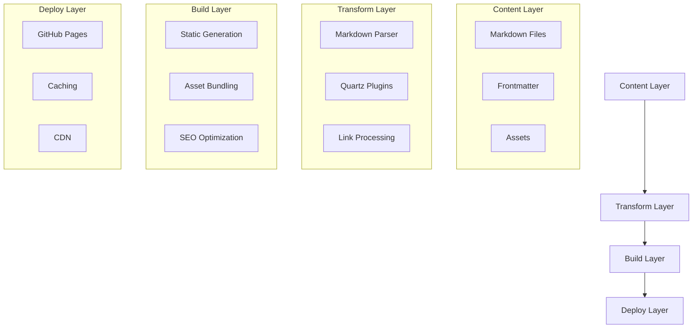
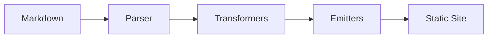
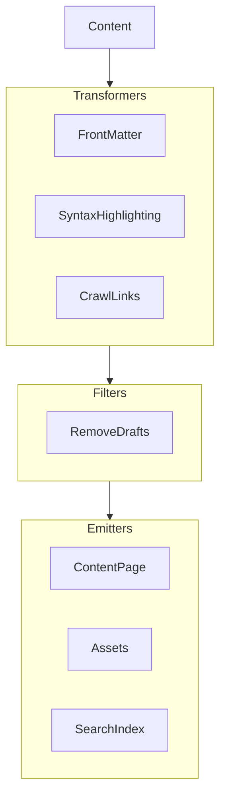

# System Patterns

## Architecture Overview

## Design Patterns

### Content Organization
1. **Domain-Driven Structure**
   - Content organized by knowledge domains
   - Clear hierarchy within domains
   - Cross-domain linking

2. **Atomic Notes**
   - Single concept per note
   - Strong interconnections
   - Progressive disclosure

3. **Content Types**
   - Knowledge notes
   - Blog posts
   - Portfolio items
   - Index pages

### Navigation Patterns
1. **Multi-Path Discovery**
   - Domain navigation
   - Tag-based browsing
   - Related content links
   - Backlinks

2. **Progressive Exploration**
   - Entry points for each domain
   - Guided paths through content
   - Suggested next reads

### Component Architecture
1. **Core Components**
   - Navigation
   - Content display
   - Search
   - Tag system

2. **Plugin System**
   - Content transformers
   - Filters
   - Emitters

## Technical Decisions

### Framework Choice
- **Quartz v4**
  - Static site generation
  - Markdown-based content
  - Plugin architecture
  - TypeScript support

### Content Management
- **File Structure**
  - Markdown with YAML frontmatter
  - Organized directory hierarchy
  - Asset management

### Build Process
1. **Content Processing**
   - Markdown parsing
   - Frontmatter extraction
   - Link processing
   - Asset optimization

2. **Static Generation**
   - Page generation
   - Search index creation
   - Asset bundling
   - SEO optimization

### Deployment
1. **GitHub Pages**
   - Automated deployment
   - Version control
   - Content backup
   - Collaboration support

## Component Relationships

### Content Flow

### Plugin Architecture

## Error Handling
1. **Build-time Validation**
   - Frontmatter validation
   - Link checking
   - Asset verification

2. **Runtime Handling**
   - 404 pages
   - Fallback content
   - Error logging

## Performance Considerations
1. **Build Optimization**
   - Efficient asset processing
   - Incremental builds
   - Cache utilization

2. **Runtime Performance**
   - Lazy loading
   - Asset optimization
   - CDN usage

## Maintenance Patterns
1. **Content Updates**
   - Version control
   - Content validation
   - Link maintenance

2. **System Updates**
   - Framework updates
   - Plugin management
   - Dependency updates